# Lucas Lica

**Desenvolvedor Full Stack**

Olá! :)

Sou desenvolvedor Full Stack e Backend focado na construção de aplicações robustas, arquitetura de APIs e liderança técnica de projetos. Minha atuação combina uma sólida base em engenharia de software, utilizando Node.js, PHP, React Native e Bancos de Dados Relacionais e Não Relacionais. A uma postura estratégica para resolver problemas reais de negócios.

Ao longo da minha trajetória, liderei equipes e entregas de ponta a ponta. Como líder da frente de Backend no projeto AUTIM, estruturei a arquitetura de APIs RESTful gerenciando um time de 6 desenvolvedores (em um projeto multidisciplinar de 16 pessoas na FATEC). Lá, implementei toda a camada de segurança com JWT, criptografia Bcrypt e controle RBAC, além de alinhar a infraestrutura de servidores VPS com NGINX.

Como Scrum Master e desenvolvedor, conduzi as sprints e a arquitetura do W.S.M. (Weather Storage Management), um sistema mobile e web projetado para a empresa Service Facility otimizar o rastreamento de lotes e fluxo de estoque no setor de climatização, solução que tive o orgulho de apresentar no CICTED 2025. No mercado, também acumulo experiência no planejamento e entrega de soluções web corporativas utilizando WordPress, PHP e MySQL.

Acredito fortemente que ensinar é a melhor forma de consolidar o conhecimento. Por isso, atuo como Monitor Acadêmico da disciplina de Técnicas Avançadas de Banco de Dados na FATEC, mentorando estudantes em SQL avançado, Stored Procedures, otimização de SGBDs e modelagem NoSQL.

Para apoiar essas entregas com infraestrutura moderna, mantenho uma rotina constante de estudos em nuvem e inteligência artificial, somando badges e certificações da AWS, Google Cloud, IBM e Microsoft.

  
  

---

## 🛠️ Tecnologias e ferramentas

  
  
  
  
  
  
  
  
  
  

---

## 📊 Estatísticas do GitHub

  
  

---

> “Estou motivado por desafios que envolvem inovação tecnológica e trabalho em equipe. Meu objetivo é atuar como desenvolvedor web e expandir minha atuação na área de análise de dados.”
